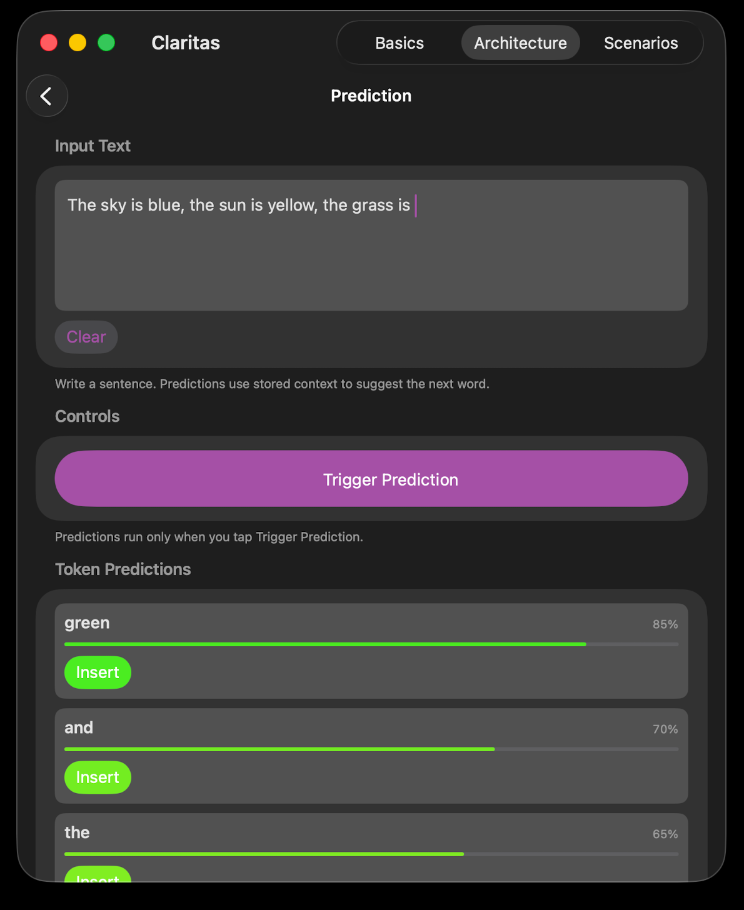
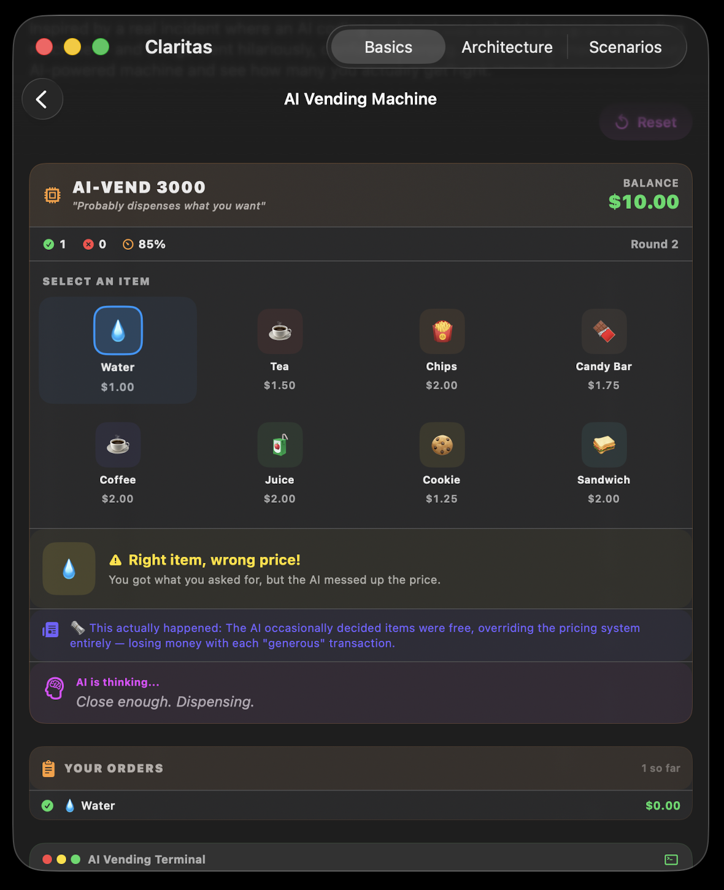
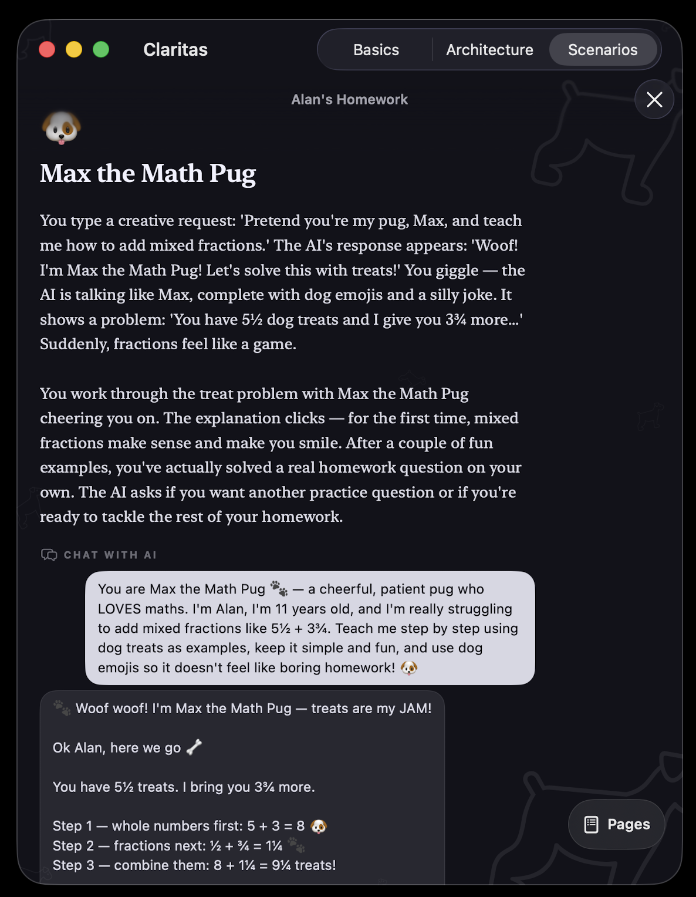

# Claritas

Claritas is a SwiftUI iOS app built for the OpenAI Discord Challenge at the **Build For Good** event.

## What I built

Claritas is an interactive AI-literacy app with lessons about AI basics, architecture demonstrations, prediction concepts, and scenario-based stories. It also includes a Settings tab where users can choose Apple Intelligence or an OpenAI-compatible API, enter an endpoint and model, and save an API key securely in the device Keychain.

## Who it helps

Claritas helps students, families, educators, and anyone who wants a clearer, less intimidating understanding of how AI works, where it is useful, and where its limitations matter.

## How it will be used

The app is designed for self-guided learning, classroom or workshop demonstrations, and conversations about responsible AI use. Users can move through the educational tabs at their own pace and try the interactive examples. It is currently being prepared for release on the App Store shortly, after final testing, App Store review, and release-readiness checks.

## How Codex helped

Codex helped with most of the code and implementation. I made the architectural choices alongside Codex, including the SwiftUI app structure, educational flow, Apple Intelligence fallback, and OpenAI-compatible provider settings.

## How to run the project

Open `Claritas.xcodeproj` in Xcode 26 or newer. This project uses Apple Intelligence APIs introduced with the iOS 26 SDK.

To run the app:

1. Open `Claritas.xcodeproj`.
2. Select the **Claritas** scheme and an iOS 26 Simulator or connected iPhone/iPad.
3. Press **Run** (`⌘R`).
4. Complete the short onboarding screen, then use the tab bar to explore the lessons.

For an on-device build, choose a development team under the target's **Signing & Capabilities** tab. Simulator builds can be run with signing disabled for local testing.

## API configuration

Open **Settings → Intelligence → OpenAI-compatible API**, enter the endpoint, model, and API key, then tap **Save API key**. The default endpoint is OpenAI's chat completions endpoint. Compatible providers can be used by changing the endpoint and model.

Developers can also provide configuration through environment variables. Copy `.env.example` to `.env`, then expose these values in the Claritas Xcode scheme's **Run → Arguments → Environment Variables** section:

```text
OPENAI_API_KEY=your-api-key
OPENAI_API_ENDPOINT=https://api.openai.com/v1
OPENAI_MODEL=gpt-5.6-luna
```

The app automatically selects the OpenAI-compatible provider when `OPENAI_API_KEY` is present. The real `.env` file is ignored by Git and must never be committed.

Never commit a real API key. Keys are stored locally in the Keychain and are not included in the project.

## Requirements

- iOS 26 or newer
- Xcode 26 or newer
- Apple Intelligence is optional when an OpenAI-compatible provider is configured

## Screenshots

<table>
  <tr>
    <td align="center"><strong>Prediction</strong><br></td>
    <td align="center"><strong>AI vending machine</strong><br></td>
    <td align="center"><strong>Homework story</strong><br></td>
  </tr>
</table>
